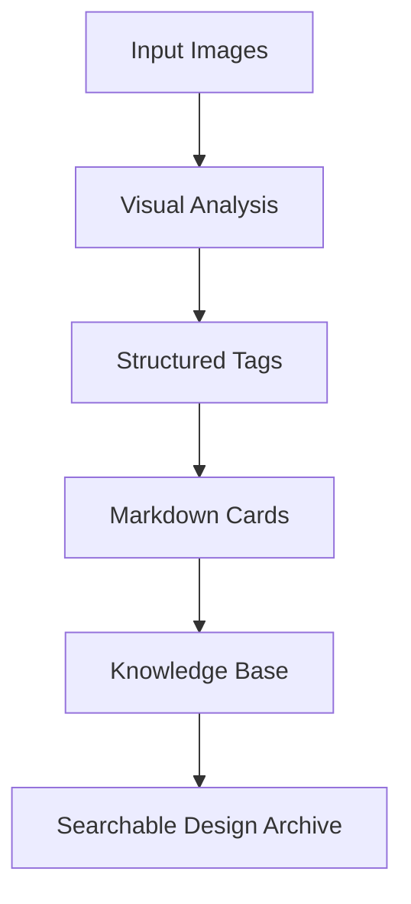
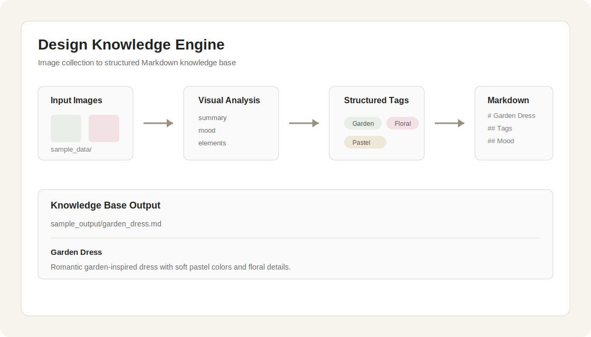

# Design Knowledge Engine

[](https://github.com/9z4k8fjtw4-dotcom/design-knowledge-engine/actions/workflows/test.yml)
[](https://github.com/9z4k8fjtw4-dotcom/design-knowledge-engine/releases)
[](LICENSE)

Turn messy design inspiration images into structured Markdown knowledge cards.

Design Knowledge Engine is a local-first workflow that helps designers, researchers, and AI builders turn image collections into searchable, reusable knowledge bases.

## Project Overview

Turn visual inspiration into structured knowledge.

A local-first workflow that converts image collections into searchable Markdown knowledge cards and automatically organizes them into a knowledge base.

```text
Images
↓
AI Analysis
↓
Structured Tags
↓
Markdown Cards
↓
Knowledge Base
```

Design Knowledge Engine is not a fashion project, not an AI model project, and not an Obsidian plugin. It is a local workflow engine for turning image collections into structured Markdown knowledge.

Visual research is easy to collect and hard to organize. Screenshots, references, mood boards, and downloaded images often stay trapped in folders with no reusable structure.

## Who Is This For?

- Designers managing large inspiration collections
- Researchers building visual reference libraries
- AI builders experimenting with image-to-knowledge workflows
- Teams turning visual materials into reusable documentation

## Before / After

| Before | After |
| --- | --- |
| A folder full of unsorted inspiration images. | Structured Markdown cards with Summary, Tags, Color Palette, Mood, Design Elements, and Use Cases. |

Design Knowledge Engine gives that collection a repeatable path:

- Local First
- Image Analysis
- Markdown Generation
- Knowledge Management
- Optional Obsidian Integration

Core capabilities:

- Image scanning
- SHA256 hash deduplication
- State machine
- Event flow
- Markdown card generation
- Knowledge base archiving
- Reserved metadata fields for future retrieval or automation workflows

Use cases:

- Fashion Design Research
- Architecture Reference Collection
- Interior Design Inspiration
- Illustration Style Library
- Photography Mood Boards
- Pinterest Archive Management

Documentation:

- [Directory Structure](docs/DIRECTORY_STRUCTURE.md)
- [Release Guide](docs/RELEASE_GUIDE.md)
- [GitHub Upload Guide](docs/GITHUB_UPLOAD_GUIDE.md)
- [Open Source Review](docs/OPEN_SOURCE_REVIEW.md)
- [Final Release Audit](docs/FINAL_RELEASE_AUDIT.md)

## Architecture



State machine:

```text
new
pending_analysis
pending_confirm
archived
rejected
duplicate
error
```

Event flow:

```text
New_Image_Event
Image_Indexed_Event
Image_Renamed_Event
Image_Analyzed_Event
Human_Confirmed_Event
Markdown_Archived_Event
```

## Installation

Clone the repository:

```bash
git clone https://github.com/9z4k8fjtw4-dotcom/design-knowledge-engine.git
cd design-knowledge-engine
```

Create a virtual environment:

```bash
python -m venv .venv
```

Activate it on macOS / Linux:

```bash
source .venv/bin/activate
```

Activate it on Windows:

```powershell
.venv\Scripts\activate
```

Install dependencies:

```bash
pip install -r requirements.txt
```

Copy the example config:

```bash
cp automation/config/settings.example.json automation/config/settings.json
```

Initialize runtime folders:

```bash
python automation/scripts/design_knowledge_engine.py init
```

## Quick Start

```bash
git clone https://github.com/9z4k8fjtw4-dotcom/design-knowledge-engine.git
cd design-knowledge-engine
python -m venv .venv
source .venv/bin/activate
pip install -r requirements.txt
cp automation/config/settings.example.json automation/config/settings.json
python automation/scripts/design_knowledge_engine.py init
```

Put your own images into:

```text
sample_data/image_batch/
```

Run:

```bash
python automation/scripts/design_knowledge_engine.py import-batch
python automation/scripts/design_knowledge_engine.py analyze
python automation/scripts/design_knowledge_engine.py markdown
python automation/scripts/design_knowledge_engine.py status
ls sample_output/inbox/03_pending_confirm
python automation/scripts/design_knowledge_engine.py confirm --file <generated-file-name> --result review
```

Replace `<generated-file-name>` with the actual image filename shown in `sample_output/inbox/03_pending_confirm/`.

## Usage

Scan new images:

```bash
python automation/scripts/design_knowledge_engine.py scan
```

Import a local image batch:

```bash
python automation/scripts/design_knowledge_engine.py import-batch
```

Generate placeholder analysis Markdown:

```bash
python automation/scripts/design_knowledge_engine.py analyze --tags reference image review
```

Regenerate Markdown:

```bash
python automation/scripts/design_knowledge_engine.py markdown
```

Check status:

```bash
python automation/scripts/design_knowledge_engine.py status
```

View files pending confirmation:

```bash
ls sample_output/inbox/03_pending_confirm
```

Confirm and archive using the actual generated image filename:

```bash
python automation/scripts/design_knowledge_engine.py confirm --file <generated-file-name> --result review
```

Replace `<generated-file-name>` with the actual file shown in `sample_output/inbox/03_pending_confirm/`.

## Demo

Put your own image into:

```text
sample_data/image_batch/
```

Example input path:

```text
sample_data/image_batch/garden_dress.jpg
```

Then run:

```bash
python automation/scripts/design_knowledge_engine.py import-batch
python automation/scripts/design_knowledge_engine.py analyze --tags reference image review
python automation/scripts/design_knowledge_engine.py markdown
python automation/scripts/design_knowledge_engine.py status
ls sample_output/inbox/03_pending_confirm
python automation/scripts/design_knowledge_engine.py confirm --file <generated-file-name> --result review
```

Expected output example:

```text
sample_output/garden_dress.md
```

Demo screenshot:



## Example Output

```markdown
# Garden Dress

## Summary

Romantic garden-inspired dress with soft pastel colors and floral details.

## Tags

* Garden
* Floral
* Romantic
* Pastel
* Lace
* Vintage

## Color Palette

* Cream White
* Soft Pink
* Sage Green

## Mood

* Gentle
* Dreamy
* Elegant

## Design Elements

* Lace trim
* Ribbon bow
* Floral embroidery
* Layered skirt

## Possible Use Cases

* Fashion Design
* Trend Research
* Inspiration Collection
```

Why not just use ChatGPT?

Traditional AI chat analysis:

- One image at a time
- Difficult to organize
- Hard to build long-term knowledge

Design Knowledge Engine:

- Batch processing
- Structured outputs
- Searchable knowledge base
- Long-term visual knowledge accumulation

What is not included:

This repository only contains the workflow engine. Private assets are intentionally excluded:

- Design archives
- Commercial case studies
- Sales data
- Brand knowledge bases
- Proprietary design language systems
- Private image collections
- Internal business documents

## License

This project is released under the [MIT License](LICENSE).

Do not commit:

- Real user images
- Private design assets
- Customer data
- Production database files
- Runtime logs
- Private knowledge base notes
